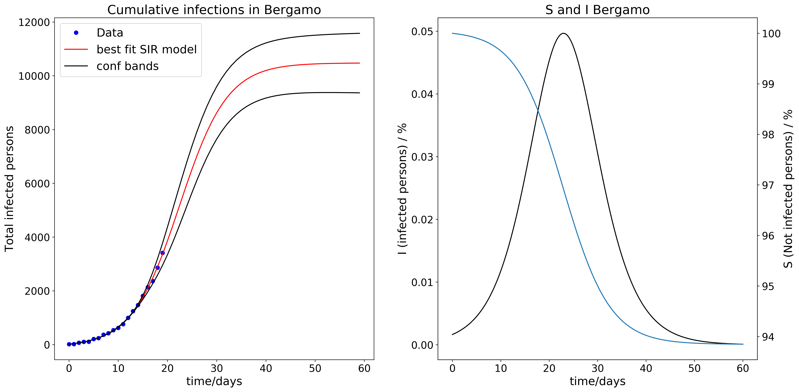
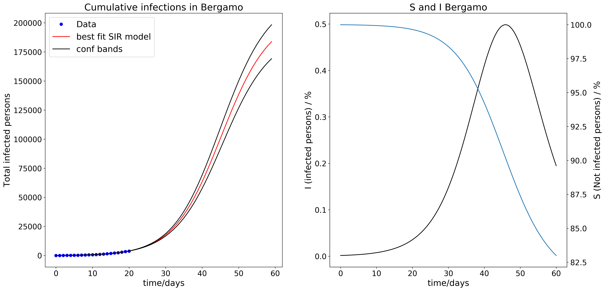
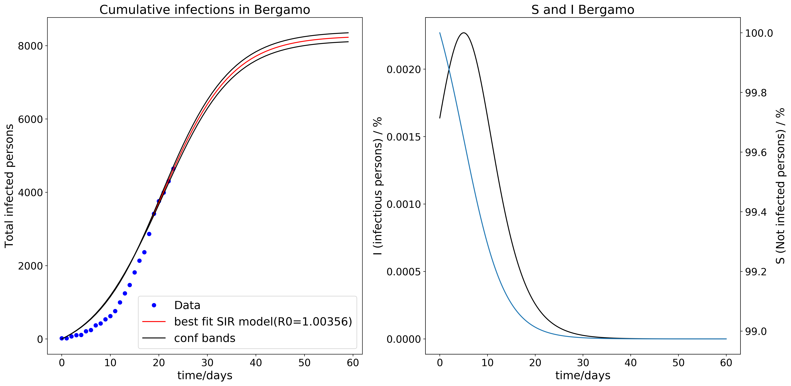
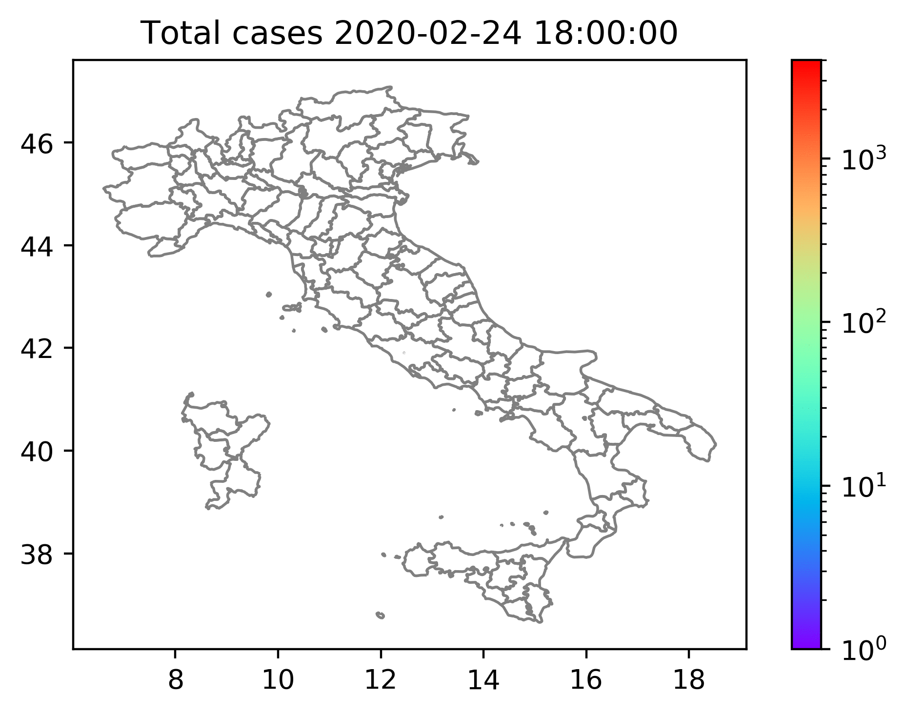

# COVID-19-regional-data-analysis-SIR

#Intro

Data Analysis results with model fitting based on as local as possible data (best data is Italian officials province based data).

Mostly ODE based modelling and parameter fitting, but also other local results

Example figure (succesfull fitting + extrapolation): Version 1503

This now unfortunately looks completely different with data from 1603

And now it starts to look different again. However, now only last 7 days' data are fitted (19.03.2020). Lets hope this is true.
Fingers crossed. Although this looks like there could be a little relief in the not too far future, there is no time to rest.
As you can see only 1%-2% of the total population would  be infected, and the infections probably went down due to strict measures. Anyhow if this is not handled carefully the epedemia even then could restart on the remaining 98%!! Maybe thats why they said 40-60% will get it. But I think better you fear too much than too little. Be careful wherever you are.

And some figure I created with geopandas:

I changed the name of the repo because it made sense.

The question I currently have is how big is R0 typically, because that is somehow unclear to everybody.
However, the italian dataset in some case fits so nicely with a SIR model including all data that you can hardly ignore that

But on the other hand if you include only last 7 days for example for Bergamo it will fit to R0=2 and humangous increase compared to the latter, where we are already beyond point of inflection.

Another question that runs around my head is that policiy in europe now is to delay instead of prevent infections sort of. I am a bit wondering why they think that the peak will not change, because I would have thought so that lowering the infection probabilities beta will always lower the amount of people that will get it in the end.

Very much interested also to suggestions relating to gamma. As this one should not change that much, whereas beta will be heavily affected by measures applied by the countries. 

Otherwise stay strong and at home and do some hell modelling  and publish and discuss.
As you can see this topic is very complicated and not only because of the model being nonlinear, but also the data
I resorted to fitting beta and gamma, but rather S0 or I0 should be included in the fitting as well

Also if somebody has insights into how to appropriately weight the data fitting with time series for prediction that would be great to know.

(I can only imagine that weights could be iteratively changed to minimize confidence bands) but obviously beta changes with time. And hopefully for the lower. LETS at least HALF BETA! I know we can do it! (by staying home). And then this prkl CORONA will DIE!! 

WATCH OUT FOR INFLECTION POINTS IN THE CUM DATA

#what I intend to do (but please join me if you want)
Generall I'll share pictures and code and data respective data scripts to merge different available sets

in the results directory are pictures I took as a snapshot from the analysis.

There is one big json file which includes the plot data.
All the other sav files are generated by lmfit (https://lmfit.github.io/lmfit-py/intro.html).
lmfit method used to save the fitting results was save_modelresult, fitresults can be loaded with load_modelresult

The json also contains the name of the saved .sav files

The code for the model function you see directly above.

Look at the wiki for more information about model and more

